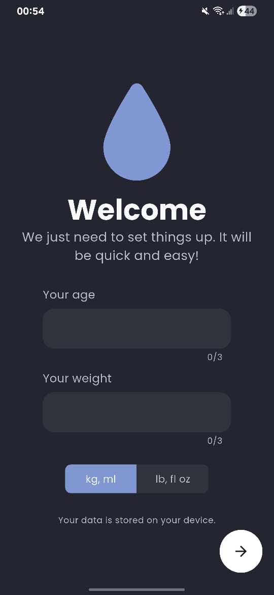
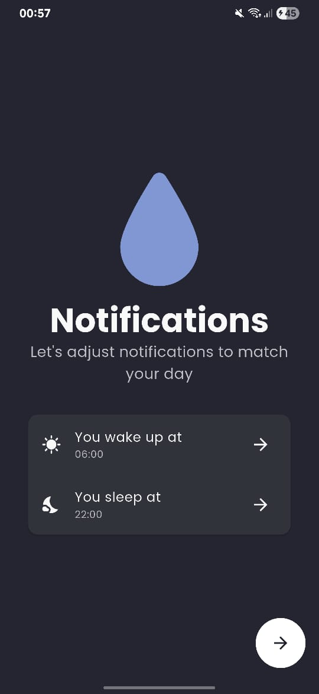
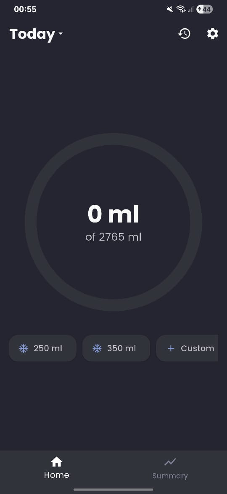
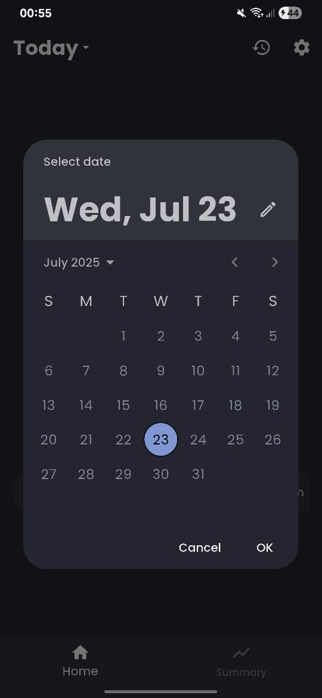
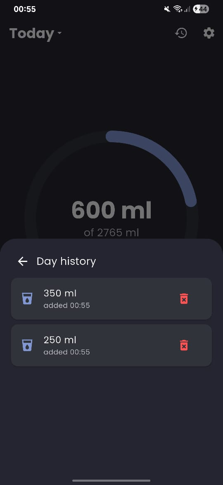
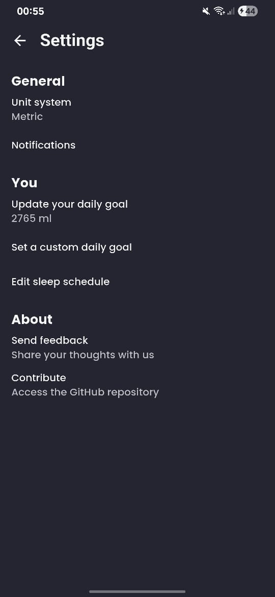

<h1 align="center">✨ Hidroly ✨</h1>
<p align="center">
Hidroly is a friendly, open-source Flutter app that helps you stay hydrated by tracking your water intake and sending notifications. It’s designed to be easy to use, without all the extra noise of typical fitness apps.
</p>
<div align="center">
  
  
  
</div>

## Table of Contents
- [Features](#features)
- [Screenshots](#screenshots)
- [Building from source](#building-from-source)
- [Contributing](#contributing)
- [License](#license)

## Features
* 🧠 Automatically calculates your daily goal and schedules reminders based on your age, weight, and sleep schedule.
* 💧 Sends smart notifications throughout the day, paused during sleep hours.
* 🥤 Log any amount with custom cup sizes tailored to your routine.
* 🎯 Set a manual goal or let the app adjust it based on your data.
* 📏 Choose between metric and imperial units.
* 📅 Track daily intake with the ability to edit or delete entries.
* 🕓 Access and update past logs to keep your history accurate.

## Screenshots

|  |            |     |
| ------------------------------------------------------ | ----------------------------------------------------------------------- | -------------------------------------------------------------------- |
|    |  |  |

## Building from source

> [!NOTE]
> 1. It's very recommended that you build this using a Linux-based OS.
> 2. Ensure you have at least 8GB of RAM to build and run this project if testing in a physical device. If testing in an emulator, you will need at least 16GB.

### Cloning
1. Run `git clone https://github.com/om1cael/hidroly.git`
2. Access the repository folder: `cd hidroly` 

### Initializing the Flutter submodule
3. In the project folder, run `git submodule update --init --recursive`
4. Set the PATH variable for the submodule: `export PATH="$(pwd)/flutter/bin:$PATH"`
5. Then, disable Flutter's analytics (optional) and download the project's dependencies:
```
./flutter/bin/flutter config --no-analytics && ./flutter/bin/flutter pub get
```

### Building an APK

#### Release
* Run `./flutter/bin/flutter build apk --release`

#### Debug
* `./flutter/bin/flutter build apk --debug` if you want to build an APK
* `./flutter/bin/flutter run` to automatically install in an emulator or physical device

# Contributing
Code, translations, bug reports, or feedback are very welcome! See [CONTRIBUTING.md](CONTRIBUTING.md) for details.

# License
This project is licensed under [GPL-3.0](https://github.com/om1cael/Hidroly/blob/main/LICENSE).

> Did you like the app or the repository? Leave a ⭐ :)
