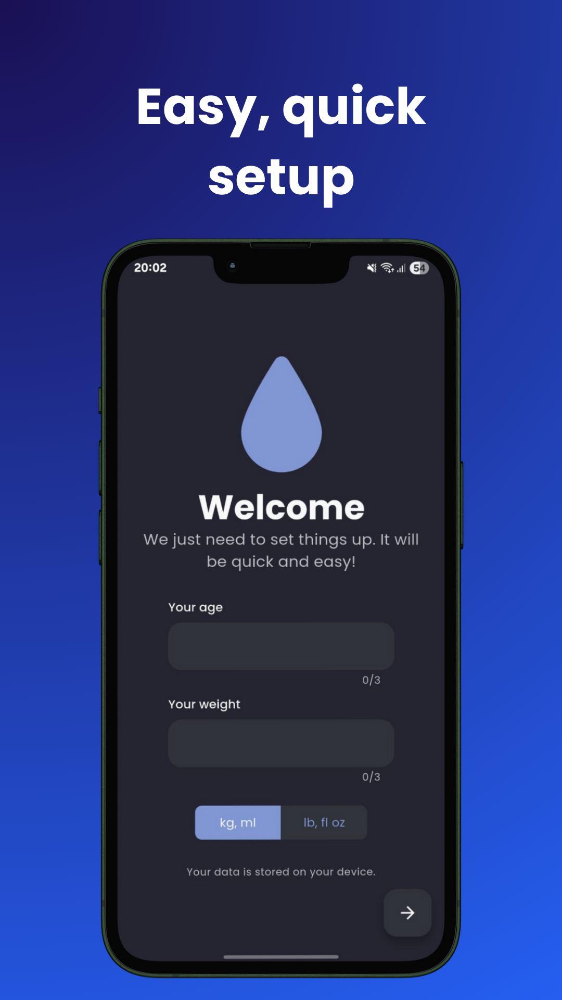
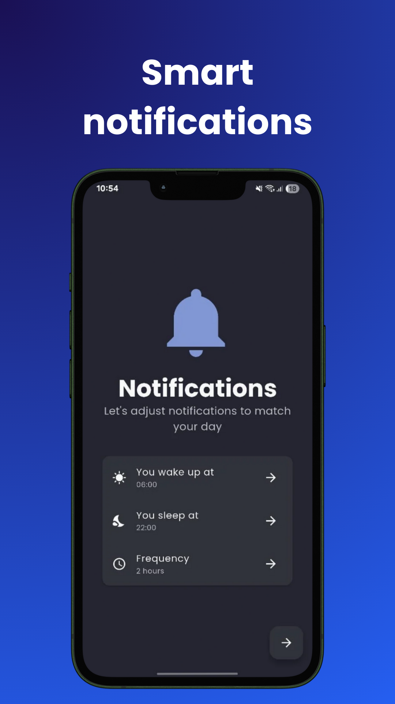
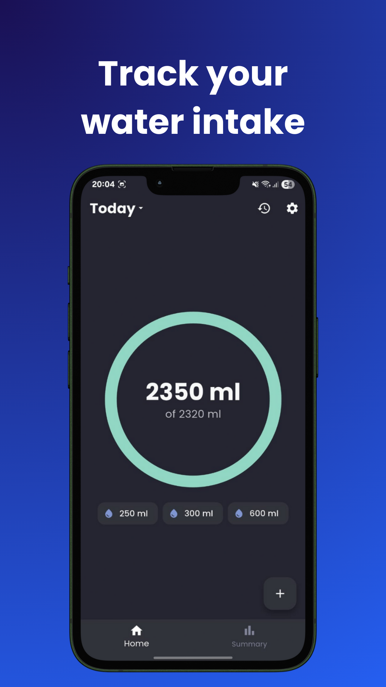
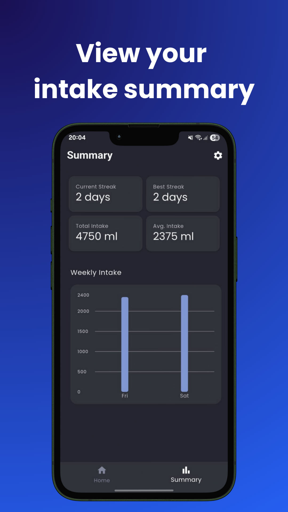
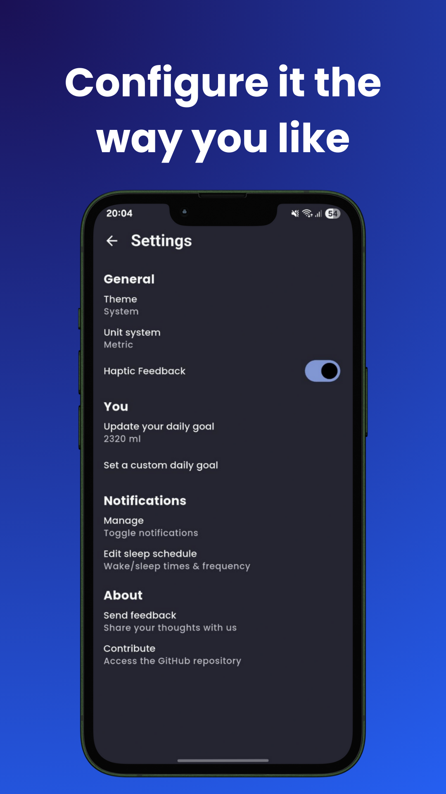

<h1 align="center">✨ Hidroly ✨</h1>
<p align="center">
Hidroly is a friendly, open-source Flutter app that helps you stay hydrated by tracking your water intake and sending notifications. It’s designed to be easy to use, without all the extra noise of typical fitness apps.
</p>
<div align="center">
  <div>
    <a href="https://f-droid.org/en/packages/com.om1cael.hidroly/">
      
    </a>
    <a href="https://apt.izzysoft.de/fdroid/index/apk/com.om1cael.hidroly">
      
    </a>
  </div>
  
  
  <a title="Crowdin" target="_blank" href="https://crowdin.com/project/hidroly"></a>
  
</div>

## Table of Contents
- [Features](#features)
- [Screenshots](#screenshots)
- [Building from source](#building-from-source)
- [Contributing](#contributing)
- [License](#license)

## Features
* 🧠 **Smart Daily Goals** - Automatically calculates your ideal daily intake and schedules reminders based on your age, weight, and sleep schedule.
* 💧 **Intelligent Notifications** - Receive timely reminders throughout the day, automatically paused during your sleep hours.
* 🥤 **Flexible Logging** - Log any amount with custom cup sizes tailored to your routine.
* 🎯 **Adaptive Goals** - Set a manual goal or let the app adjust it dynamically based on your data.
* 📏 **Unit Options** - Choose between metric and imperial measurements.
* 📅 **Complete Intake Tracking** - Track daily intake with full control to edit or delete entries.
* 🕓 **History Access** - Review and update past logs to maintain accurate records.
* 📊 **Weekly Summary & Insights** - See your weekly intake at a glance with a visual chart, total and average intake, current streak, and best streak.

## Screenshots

|         |      |         |
|----------------------------------------------------------------------------------------|----------------------------------------------------------------------------------------------|----------------------------------------------------------------------------------------|
|       | 


## Building from source

> [!NOTE]
> 1. It's very recommended that you build this using a Linux-based OS.
> 2. Ensure you have at least 8GB of RAM to build and run this project if testing in a physical device. If testing in an emulator, you will need at least 16GB.

### Cloning
1. Run `git clone https://github.com/om1cael/hidroly.git`
2. Access the repository folder: `cd hidroly` 

### Initializing the Flutter submodule
3. In the project folder, run `git submodule update --init --recursive`
4. Set the PATH variable for the submodule: `export PATH="$(pwd)/flutter/bin:$PATH"`
5. Then, disable Flutter's analytics (optional) and download the project's dependencies:
```
./flutter/bin/flutter config --no-analytics && ./flutter/bin/flutter pub get
```

### Building an APK

#### Release
* Run `./flutter/bin/flutter build apk --release`

#### Debug
* `./flutter/bin/flutter build apk --debug` if you want to build an APK
* `./flutter/bin/flutter run` to automatically install in an emulator or physical device

# Contributing
Code, translations, bug reports, or feedback are very welcome! See [CONTRIBUTING.md](CONTRIBUTING.md) for details.

# License
This project is licensed under [GPL-3.0](https://github.com/om1cael/Hidroly/blob/main/LICENSE).

> Did you like the app or the repository? Leave a ⭐ :)
